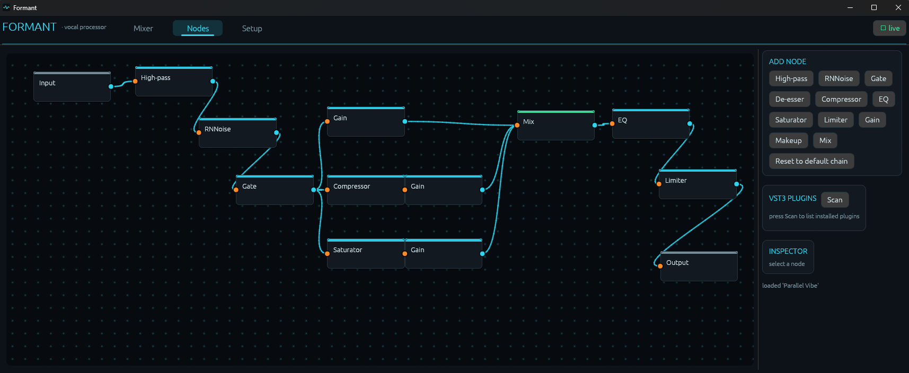
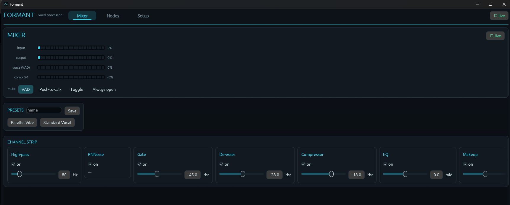

# Formant

Real-time voice processing for Windows that does not touch your GPU, phone home,
or leave a service running in the background. It cleans up your microphone,
shapes your voice, and hands the result to Discord, OBS, or a game as if it were
a second mic.

[](https://github.com/ABowlOfEleven/Formant/actions/workflows/ci.yml)
[](LICENSE)




*The node editor with the Parallel Vibe preset loaded: the cleaned voice splits
into dry, compressed, and saturated paths, then recombines through a Mix node.*

## Why it exists

Voicemod is a lot of software for what most people actually use it for: a clean
vocal chain and noise reduction. That convenience costs VRAM, a constant
connection to someone else's API, and a steady drip of upsells. Formant is the
part worth keeping. It runs a small RNNoise model and a handful of well-tuned
effects on the CPU, with nothing reaching out to the network, and it routes into
anything through a virtual audio cable.

It began as a straight replacement for that daily workflow and then grew a node
editor, so the simple case stays simple and the deep case is there when you want
it.

## How it works

```
your mic  ->  Formant's chain  ->  your headphones  (so you can hear yourself)
                              \->  a virtual cable  ->  Discord / OBS / game
```

One mono input, processed once, sent to two places at the same time: your own
ears, and a virtual microphone that every other app reads from. Point an app's
microphone at the cable and you are finished.

## What you get



**The chain.** High-pass, RNNoise denoise, gate, de-esser, compressor, 3-band EQ,
saturator, limiter, and gain. Enough to take a raw mic to a finished voice, with
bypass on every node and a global bypass for quick before-and-after. The Mixer
tab lays the chain out as a channel strip with live meters.

**A real node editor.** Pan, zoom, and wire it however you like. A Mix node sums
its inputs and any output can fan out, so you can build parallel compression,
blend-in saturation, and dry/wet balance, not just a single line of effects.

**Your plugins, hosted.** Formant finds the VST3 plugins already installed on
your machine, lets you drop them in as nodes, opens their own editor windows, and
saves their settings inside your presets.

**Mic control that stays out of the way.** Voice-activity gating by default, plus
push-to-talk, toggle, and always-open, all on global hotkeys you can rebind or
clear.

**It lives in the tray.** Close the window and the audio keeps running. One
instance only, an optional start-with-Windows toggle, and it reopens on the exact
chain you left behind.

**No glitches.** A drift-compensated resampler on the output path keeps capture
and playback clocks in step, so long sessions do not slowly drift into crackle.

## Requirements

- Windows 10 or 11.
- A virtual audio device so other apps can read Formant as a microphone. VB-CABLE
  (free) or Voicemeeter both work.
- Headphones or speakers, if you want to monitor yourself.

## Install

Grab the MSI from the
[Releases](https://github.com/ABowlOfEleven/Formant/releases) page for a normal
install, or the portable zip if you would rather not run an installer.

To build from source instead (per-user, no admin needed):

```powershell
pwsh packaging/install.ps1            # build release, install, add a Start Menu shortcut
pwsh packaging/install.ps1 -Desktop   # also add a Desktop shortcut
pwsh packaging/uninstall.ps1          # remove (add -Purge to also delete config and presets)
pwsh packaging/build-portable.ps1     # build a portable zip into dist/
pwsh packaging/build-msi.ps1          # build the MSI into dist/
```

The script installer puts Formant in `%LOCALAPPDATA%\Programs\Formant`; the MSI
installs to `Program Files`. Either way, config and presets live in
`%APPDATA%\Formant`.

## First run

1. Open the **Setup** tab. Pick your microphone as the capture device, your
   headphones as the monitor output, and your virtual cable as the second output.
2. In Discord, OBS, or your game, set the microphone to that same virtual cable.
3. Shape your sound in the **Mixer** and **Nodes** tabs, or just load a preset.

Two presets ship with the app to get you going:

- **Standard Vocal** is the classic single chain: high-pass, denoise, gate,
  de-esser, compressor, EQ, makeup.
- **Parallel Vibe** splits the cleaned voice three ways into a dry path, a
  heavily compressed parallel path, and a saturated path, then blends them back
  together through a Mix node. It is a good tour of the parallel routing.

## Build and test

```sh
cargo test                              # core DSP, engine, and preset tests
cargo run -p formant -- --seconds 5     # headless: stream mic through the chain and report stats
cargo run -p formant                    # the full GUI
```

The whole DSP and graph core is testable without a microphone, which is how the
math stays honest.

## How it is organized

- `crates/core` (`formant-core`): DSP, the graph engine, routing, presets, and
  session state. Pure and fully unit-tested without an audio device.
- `crates/audio` (`formant-audio`): the Windows WASAPI backend, device
  enumeration, and global hotkeys.
- `crates/vst3` (`formant-vst3`): VST3 discovery and hosting.
- `crates/app` (`formant`): the egui interface, the tray, and the glue between
  them.

See [SPEC.md](SPEC.md) for the design and architecture in more detail.

## License

Formant is free software under the GNU General Public License, version 3 or
later. See [LICENSE](LICENSE) for the full text.

Copyright (C) 2026 Ethan Belanger.

It is GPLv3 because it hosts VST3 plugins through Steinberg's interface
definitions, which are themselves available under GPLv3 (or a separate Steinberg
commercial license).

Formant builds on open-source work by others, including RNNoise for noise
reduction and egui for the interface. See [THIRD-PARTY-NOTICES.md](THIRD-PARTY-NOTICES.md)
for credits. VST is a trademark of Steinberg Media Technologies GmbH; Formant is
an independent project and is not affiliated with Steinberg.
